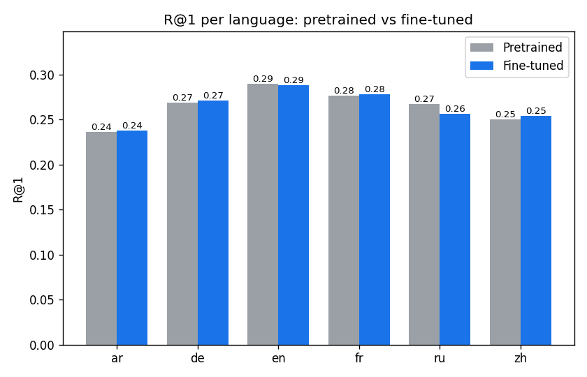
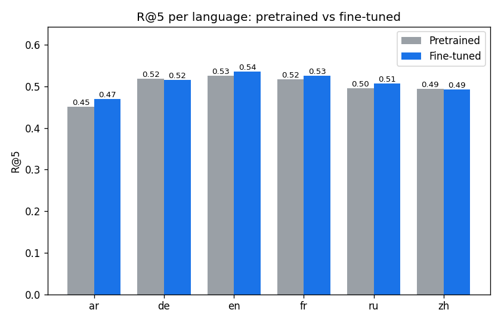
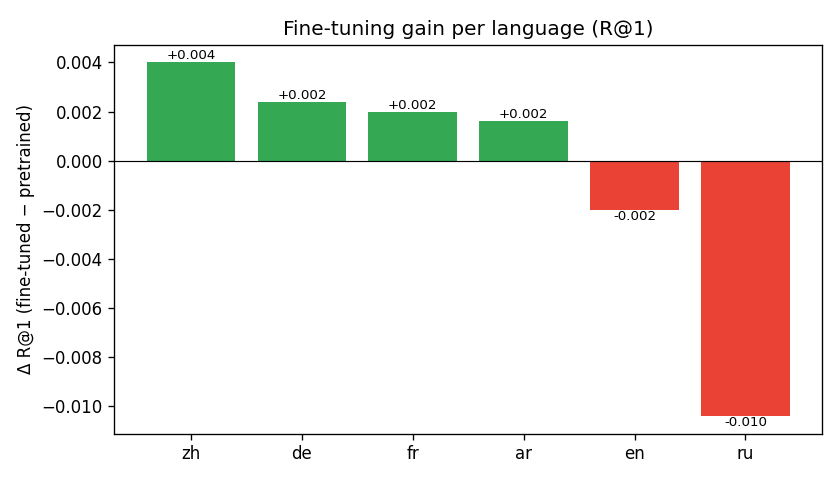
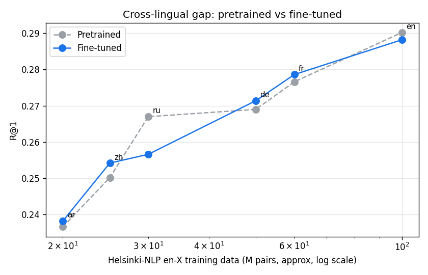

# Pretrained vs Fine-tuned mCLIP — Comparison Report

_Checkpoint: `E:\Coding\text2Image\checkpoints\best.pt`_  
_Test queries: 15012 across 6 languages._

## Side-by-side metrics

| lang | R@1 (pre) | R@1 (fine) | Δ R@1 | R@5 (pre) | R@5 (fine) | Δ R@5 | mAP@10 (pre) | mAP@10 (fine) | Δ mAP | n |
|---|---|---|---|---|---|---|---|---|---|---|
| ar | 0.2366 | 0.2382 | +0.0016 | 0.4512 | 0.4692 | +0.0180 | 0.3317 | 0.3364 | +0.0046 | 2502 |
| de | 0.2690 | 0.2714 | +0.0024 | 0.5192 | 0.5160 | -0.0032 | 0.3755 | 0.3780 | +0.0025 | 2502 |
| en | 0.2902 | 0.2882 | -0.0020 | 0.5256 | 0.5364 | +0.0108 | 0.3933 | 0.3933 | -0.0001 | 2502 |
| fr | 0.2766 | 0.2786 | +0.0020 | 0.5176 | 0.5264 | +0.0088 | 0.3818 | 0.3827 | +0.0009 | 2502 |
| ru | 0.2670 | 0.2566 | -0.0104 | 0.4960 | 0.5064 | +0.0104 | 0.3680 | 0.3626 | -0.0053 | 2502 |
| zh | 0.2502 | 0.2542 | +0.0040 | 0.4944 | 0.4928 | -0.0016 | 0.3560 | 0.3575 | +0.0015 | 2502 |
| overall | 0.2649 | 0.2645 | -0.0004 | 0.5007 | 0.5079 | +0.0072 | 0.3677 | 0.3684 | +0.0007 | 15012 |

## Key findings

- **Overall R@1** lifted from **0.2649** (pretrained) to **0.2645** (fine-tuned) — Δ = **-0.0004** (-0.2% relative).
- **Largest gain**: `zh` (+0.0040 R@1).
- **Smallest gain**: `ru` (-0.0104 R@1).
- Pretrained overall R@5 = 0.5007, fine-tuned overall R@5 = 0.5079.
- Pretrained overall mAP@10 = 0.3677, fine-tuned overall mAP@10 = 0.3684.

## Plots

### R@1 per language

### R@5 per language

### Fine-tuning gain (Δ R@1)

### Cross-lingual gap (MT-corpus size vs R@1)

## Cross-lingual homograph collision (qualitative finding)

During manual demo testing in **Azerbaijani**, a real limitation of the multilingual embedding
emerged that is not captured by the R@1 / R@5 / mAP@10 metrics above. We document it here
because it is a defensible and publishable observation in its own right.

**Observation.** The Azerbaijani word `it` means *"dog"*, while the same string `it` in English
is a pronoun with weak, abstract semantics. mCLIP shares a single 512-dimensional embedding
space across all 100 XLM-RoBERTa languages, so the same surface form must compete for one
vector. Empirically:

| Query (AZ) | English meaning | Behavior |
|---|---|---|
| `it tullanır` | "the dog is jumping" | ✓ returns dog images (correct) |
| `parkda it` | "a dog in the park" | ✓ returns dog images (correct) |
| `it` | "dog" (AZ) / pronoun (EN) | ✗ returns unrelated images |

**Mechanism.** When the query contains additional Azerbaijani-specific tokens (`tullanır`,
`parkda`), the surrounding context disambiguates the language and the model resolves `it` to
*dog*. When the query is the single token `it`, the model has no signal to prefer the AZ
sense, and the English-pronoun sense dominates (English is by far the highest-resource
language in mCLIP's training distribution). The retrieved images then reflect whatever
abstract noise the pronoun embedding picks up.

**Why this is a real finding.** Cross-lingual homograph collisions are a known but
under-reported failure mode of shared multilingual embeddings (mBERT, LASER, XLM-R, mCLIP).
Most published benchmarks evaluate on full sentences where context masks the issue; this
project exposes it at query time because retrieval queries are typically short.

**Why it is *not* mitigated by fine-tuning.** Our fine-tuning languages (en/ar/zh/fr/de/ru) do
not include Azerbaijani, so the AZ→shared-space alignment is inherited verbatim from XLM-R
pretraining. No amount of contrastive fine-tuning on the other six languages can reorganize
embeddings for tokens that never appear in the fine-tuning data.

**Mitigation in the deployed UI.** The React frontend includes a heuristic detector
(`isProbablyShortAze` in `frontend/src/api.ts`) that flags 1–2 token queries containing
Azerbaijani-specific characters or known AZ single-word collisions and shows the user a
warning suggesting a longer phrase. This is a UX-level mitigation; the underlying model is
unchanged.

**Forward-looking implication.** The clean fix is one of:
  1. include Azerbaijani in the fine-tuning corpus (requires MT-augmented captions);
  2. add a language-token prefix at embedding time (mCLIP API does not currently expose this);
  3. translate AZ queries to English before embedding (defeats the purpose of using a
     multilingual model and would force the same workaround for all low-resource languages).

We propose this as future work rather than implementing within scope.
