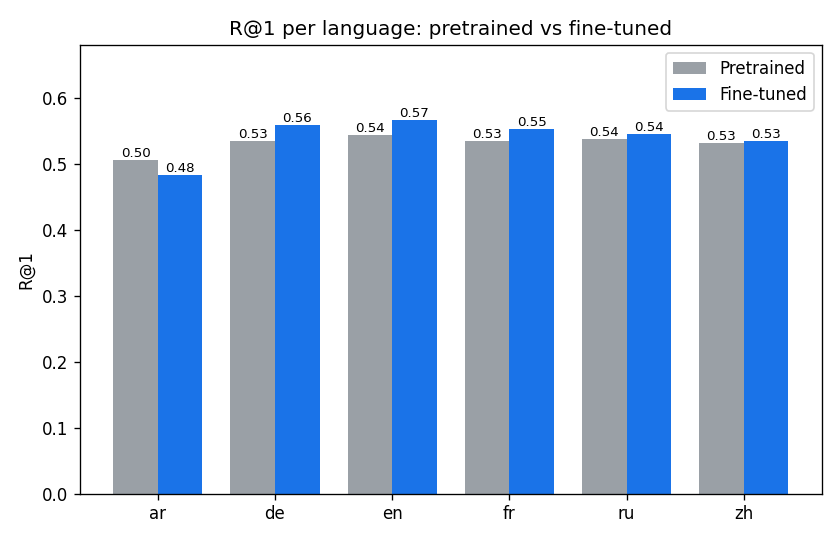
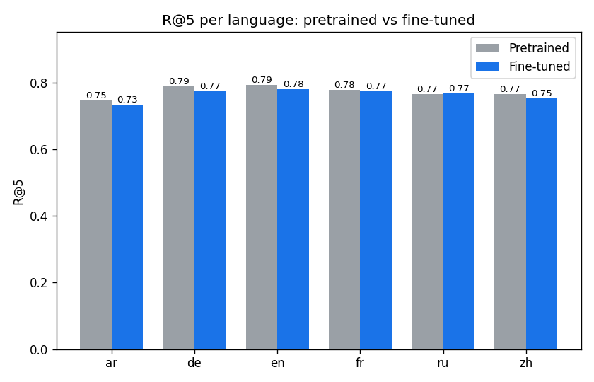
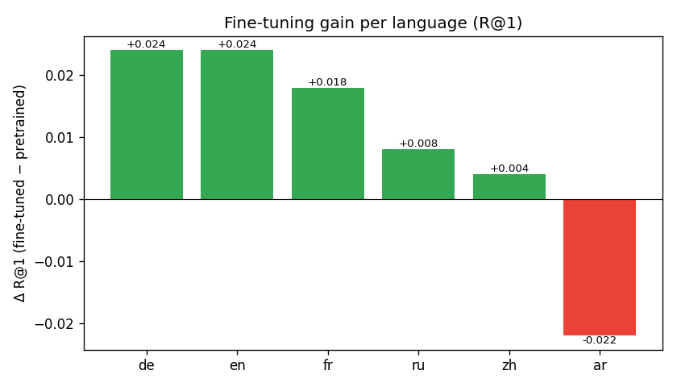
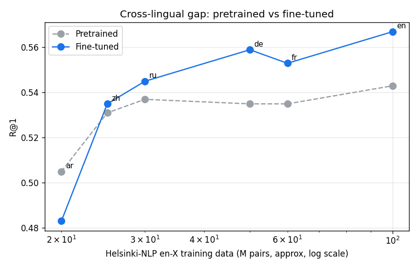

# Pretrained vs Fine-tuned mCLIP — Comparison Report

_Checkpoint: `E:\Coding\text2Image\checkpoints\best.pt`_  
_Test queries: 3006 across 6 languages._

## Side-by-side metrics

| lang | R@1 (pre) | R@1 (fine) | Δ R@1 | R@5 (pre) | R@5 (fine) | Δ R@5 | mAP@10 (pre) | mAP@10 (fine) | Δ mAP | n |
|---|---|---|---|---|---|---|---|---|---|---|
| ar | 0.5050 | 0.4830 | -0.0220 | 0.7465 | 0.7345 | -0.0120 | 0.6093 | 0.5968 | -0.0125 | 501 |
| de | 0.5349 | 0.5589 | +0.0240 | 0.7884 | 0.7745 | -0.0140 | 0.6463 | 0.6593 | +0.0131 | 501 |
| en | 0.5429 | 0.5669 | +0.0240 | 0.7944 | 0.7804 | -0.0140 | 0.6510 | 0.6637 | +0.0128 | 501 |
| fr | 0.5349 | 0.5529 | +0.0180 | 0.7784 | 0.7745 | -0.0040 | 0.6438 | 0.6542 | +0.0104 | 501 |
| ru | 0.5369 | 0.5449 | +0.0080 | 0.7665 | 0.7685 | +0.0020 | 0.6401 | 0.6428 | +0.0026 | 501 |
| zh | 0.5309 | 0.5349 | +0.0040 | 0.7665 | 0.7525 | -0.0140 | 0.6346 | 0.6363 | +0.0017 | 501 |
| overall | 0.5309 | 0.5403 | +0.0093 | 0.7735 | 0.7641 | -0.0093 | 0.6375 | 0.6422 | +0.0047 | 3006 |

## Key findings

- **Overall R@1** lifted from **0.5309** (pretrained) to **0.5403** (fine-tuned) — Δ = **+0.0093** (+1.8% relative).
- **Largest gain**: `en` (+0.0240 R@1).
- **Smallest gain**: `ar` (-0.0220 R@1).
- Pretrained overall R@5 = 0.7735, fine-tuned overall R@5 = 0.7641.
- Pretrained overall mAP@10 = 0.6375, fine-tuned overall mAP@10 = 0.6422.

## Plots

### R@1 per language

### R@5 per language

### Fine-tuning gain (Δ R@1)

### Cross-lingual gap (MT-corpus size vs R@1)

