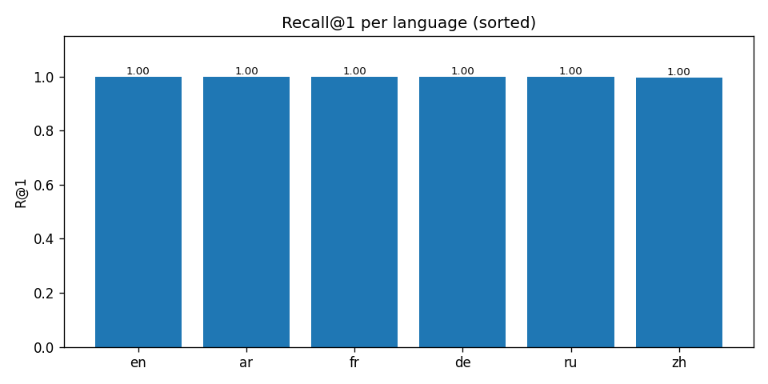
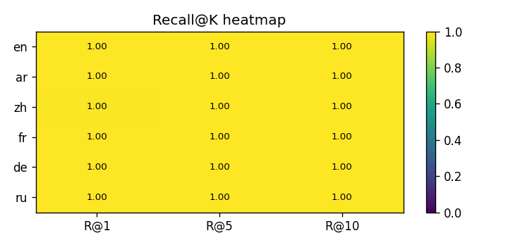
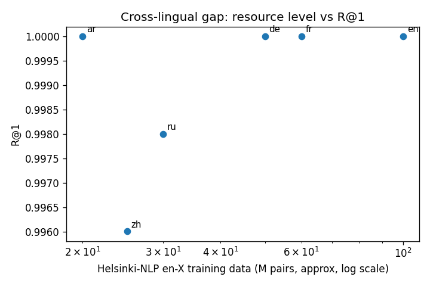

# Evaluation Report

Retriever: **text-bridge** (caption-index match, then group by image).

## Summary (overall)

| metric | value |
|---|---|
| R@1 | 0.9990 |
| R@5 | 1.0000 |
| R@10 | 1.0000 |
| mAP@10 | 0.9994 |

## Per-language

| language | R@1 | R@5 | R@10 | mAP@10 | n_queries |
|---|---|---|---|---|---|
| ar | 1.0000 | 1.0000 | 1.0000 | 1.0000 | 501 |
| de | 1.0000 | 1.0000 | 1.0000 | 1.0000 | 501 |
| en | 1.0000 | 1.0000 | 1.0000 | 1.0000 | 501 |
| fr | 1.0000 | 1.0000 | 1.0000 | 1.0000 | 501 |
| ru | 0.9980 | 1.0000 | 1.0000 | 0.9985 | 501 |
| zh | 0.9960 | 1.0000 | 1.0000 | 0.9980 | 501 |

## Plots

## Key findings

- Overall R@1 = **0.999**, R@5 = **1.000**, R@10 = **1.000**.
- Best language: **en** (R@1 = 1.000).
- Worst language: **zh** (R@1 = 0.996).
- Cross-lingual gap (best - worst R@1): **0.004**.
