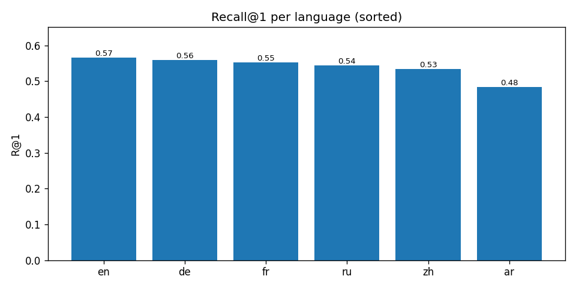
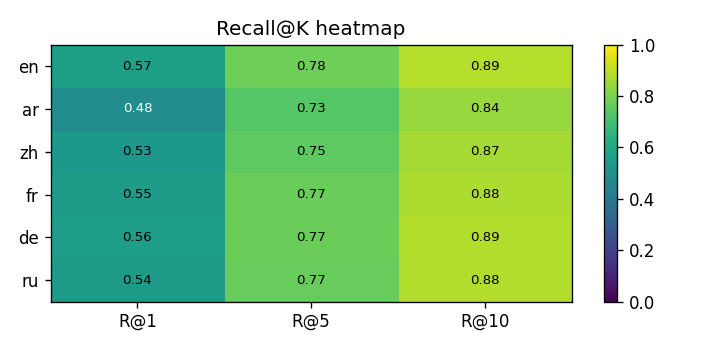
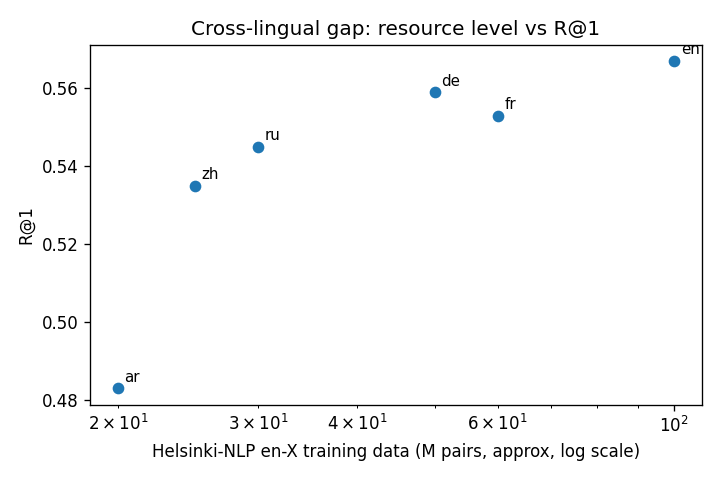

# Evaluation Report

Retriever: **two-stage** (FAISS image index + exact re-rank).

## Summary (overall)

| metric | value |
|---|---|
| R@1 | 0.5403 |
| R@5 | 0.7641 |
| R@10 | 0.8743 |
| mAP@10 | 0.6422 |

## Per-language

| language | R@1 | R@5 | R@10 | mAP@10 | n_queries |
|---|---|---|---|---|---|
| ar | 0.4830 | 0.7345 | 0.8443 | 0.5968 | 501 |
| de | 0.5589 | 0.7745 | 0.8862 | 0.6593 | 501 |
| en | 0.5669 | 0.7804 | 0.8882 | 0.6637 | 501 |
| fr | 0.5529 | 0.7745 | 0.8762 | 0.6542 | 501 |
| ru | 0.5449 | 0.7685 | 0.8842 | 0.6428 | 501 |
| zh | 0.5349 | 0.7525 | 0.8663 | 0.6363 | 501 |

## Plots

## Key findings

- Overall R@1 = **0.540**, R@5 = **0.764**, R@10 = **0.874**.
- Best language: **en** (R@1 = 0.567).
- Worst language: **ar** (R@1 = 0.483).
- Cross-lingual gap (best - worst R@1): **0.084**.
